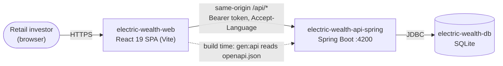
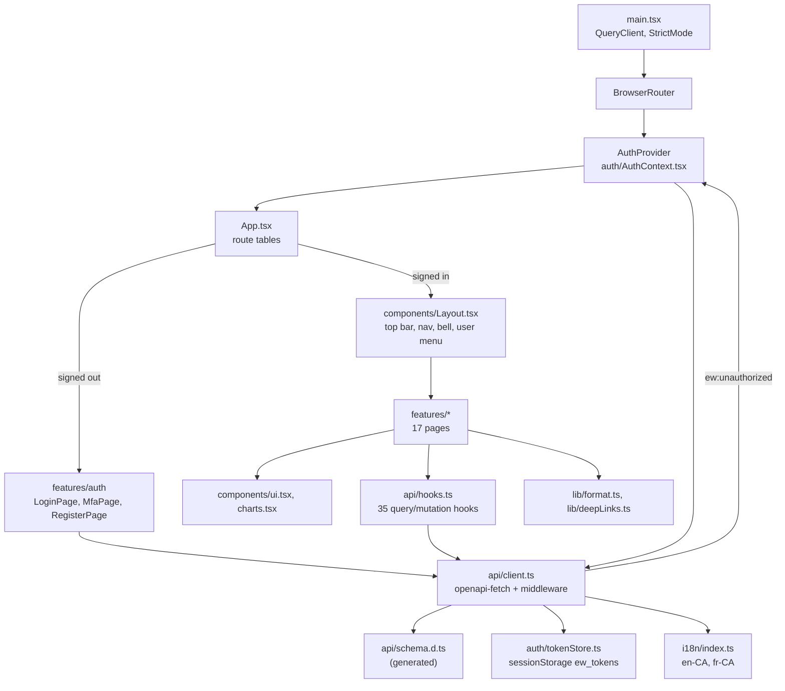
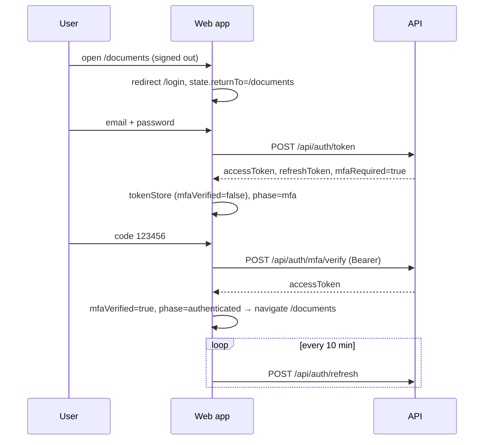

## 24. Appendix A: Architecture Diagram

**System context**

```mermaid
flowchart LR
  user(["Retail investor<br/>(browser)"]) -->|HTTPS| web["electric-wealth-web<br/>React 19 SPA (Vite)"]
  web -->|"same-origin /api/*<br/>Bearer token, Accept-Language"| api["electric-wealth-api-spring<br/>Spring Boot :4200"]
  api -->|JDBC| db[("electric-wealth-db<br/>SQLite")]
  web -. "build time: gen:api reads openapi.json" .-> api
```

**Inside the web app**

```mermaid
flowchart TB
  main["main.tsx<br/>QueryClient, StrictMode"] --> router["BrowserRouter"] --> authp["AuthProvider<br/>auth/AuthContext.tsx"] --> app["App.tsx<br/>route tables"]
  app -->|signed out| authpages["features/auth<br/>LoginPage, MfaPage, RegisterPage"]
  app -->|signed in| layout["components/Layout.tsx<br/>top bar, nav, bell, user menu"]
  layout --> pages["features/*<br/>17 pages"]
  pages --> ui["components/ui.tsx, charts.tsx"]
  pages --> hooks["api/hooks.ts<br/>35 query/mutation hooks"]
  authpages --> client
  authp --> client
  hooks --> client["api/client.ts<br/>openapi-fetch + middleware"]
  client --> schema["api/schema.d.ts<br/>(generated)"]
  client --> tokens["auth/tokenStore.ts<br/>sessionStorage ew_tokens"]
  client --> i18n["i18n/index.ts<br/>en-CA, fr-CA"]
  pages --> lib["lib/format.ts, lib/deepLinks.ts"]
  client -->|"ew:unauthorized"| authp
```

**Sign-in sequence**

```mermaid
sequenceDiagram
  participant U as User
  participant W as Web app
  participant A as API
  U->>W: open /documents (signed out)
  W->>W: redirect /login, state.returnTo=/documents
  U->>W: email + password
  W->>A: POST /api/auth/token
  A-->>W: accessToken, refreshToken, mfaRequired=true
  W->>W: tokenStore (mfaVerified=false), phase=mfa
  U->>W: code 123456
  W->>A: POST /api/auth/mfa/verify (Bearer)
  A-->>W: accessToken
  W->>W: mfaVerified=true, phase=authenticated → navigate /documents
  loop every 10 min
    W->>A: POST /api/auth/refresh
  end
```

